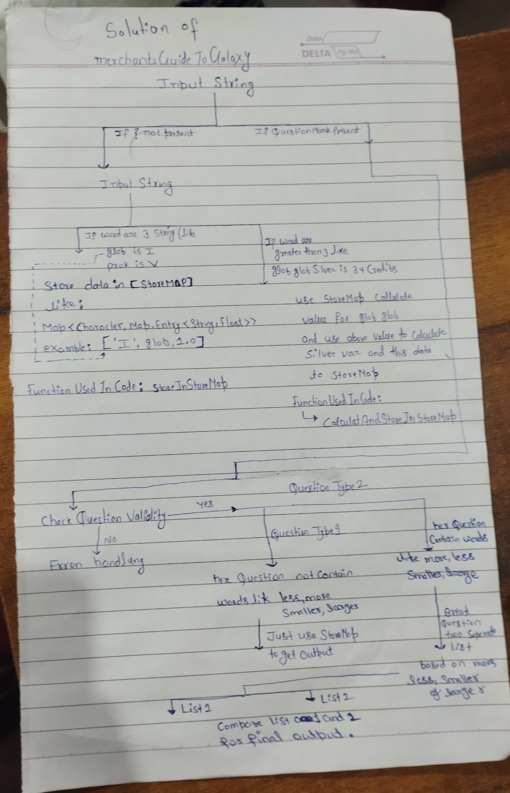

Problem Statment:

You decided to give up on earth after the latest
financial collapse left 99.99% of the earth's
population with 0.01% of the wealth. Luckily,
with the scant sum of money that is left in your
account, you are able to afford to rent a 
spaceship, leave earth, and fly all over 
the galaxy to sell common metals and dirt 
(which apparently is worth a lot). Buying
and selling over the galaxy
requires you to convert numbers and units,
and you decided to write a program to help you.The
numbers used for intergalactic transactions
follows similar convention to the roman numerals and
you have painstakingly collected the 
appropriate translation between them. Roman numerals are
based on seven symbols:
Symbol Value
I 1
V 5
X 10
L 50
C 100
D 500
M 1,000
Numbers are formed by combining symbols together 
and adding the values. For example, MMVI is
1000 + 1000 + 5 + 1 = 2006. Generally, symbols 
are placed in order of value, starting with the
largest values. When smaller values precede
larger values, the smaller values are subtracted from
the larger values, and the result is added 
to the total. For example MCMXLIV = 1000 + (1000 −
100) + (50 − 10) + (5 − 1) = 1944.
The symbols "I", "X", "C", and "M" can be 
repeated three times in succession, but no more. (They
may appear four times if the third and 
fourth are separated by a smaller value, such as XXXIX.)
"D", "L", and "V" can never be repeated.
"I" can be subtracted from "V" and "X" 
only. "X" can be subtracted from "L" and "C"
only. "C" can
be subtracted from "D" and "M" only. "V", "L",
and "D" can never be subtracted.
Only one small-value symbol may be subtracted 
from any large-value symbol.
A number written in Arabic numerals can be broken
into digits. For example, 1903 is composed of
1, 9, 0, and 3. To write the Roman numeral, each 
of the non-zero digits should be treated separately.
In the above example, 1,000 = M, 900 = CM, and
3 = III. Therefore, 1903 = MCMIII.
-- Source: Wikipedia (http://en.wikipedia.org/wiki/Roman_numerals)

Solution:

IN the Entire Problem the main Logic Is:

 public int romanToInt(String s) {
         int ans = 0, num = 0;
        for (int i = s.length()-1; i >= 0; i--) {
            switch(s.charAt(i)) {
                case 'I': num = 1; break;
                case 'V': num = 5; break;
                case 'X': num = 10; break;
                case 'L': num = 50; break;
                case 'C': num = 100; break;
                case 'D': num = 500; break;
                case 'M': num = 1000; break;
            }
            if (4 * num < ans) ans -= num;
            else ans += num;
        }
        return ans;
    }

and as Well as

bool ValidationOfRomanNumerals(string str)
{

    const regex pattern("^M{0,3}(CM|CD|D?C{0,3})(XC|XL|L?X{0,3})(IX|IV|V?I{0,3})$");

    if (str.empty()) {
        return false;
    }
    if (regex_match(str, pattern)) {
        return true;
    }
    else {
        return false;
    }
}

